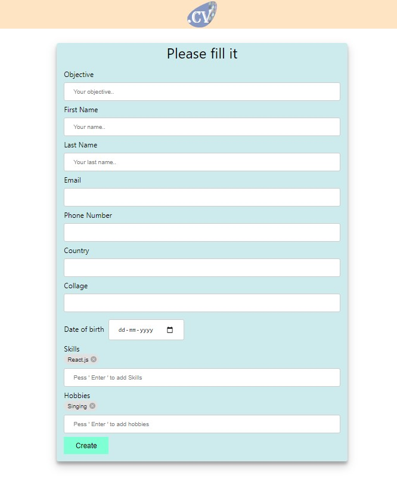
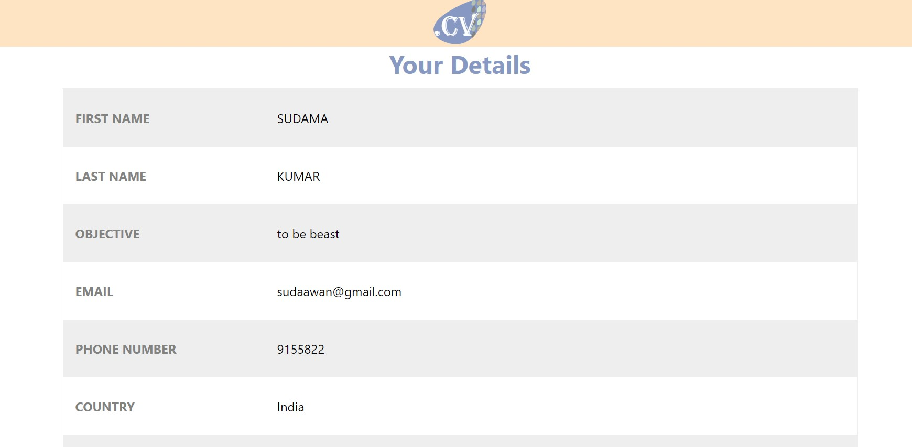

# .CV
## used dependencies are  and 'XLSX' to convert user data to a excel file

### to run it localy just clone and "npm install" and "npm run"

# .CV

just fill the form and download a EXCEL file to your device.

## Getting Started
  To run it localy  `npm install` and `npm start` .
  Can be compiled by `npm build`
### Dependencies

* Chip (part of material ui)
* XLSX ( To convert form data into a exel sheet)

### Some screenshots 

